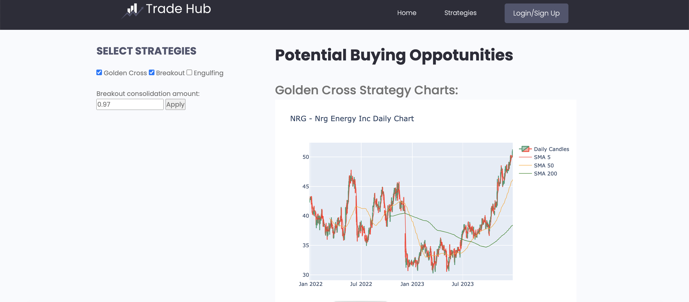

## JOSEPH MILLER - SOFTWARE AND DATA ENGINEER

**Languages**
 

 
**Frameworks**
 

 
**Libraries**
 

 
**Other**
 

## ABOUT ME

My coding journey first began during lockdown as a way to pass the time, initially I had very little expectation but soon fell in love with the process of writing and debugging my own code.  My introduction to coding was though independent learning completing various online Udemy courses which I used to learn Python and associated libraries.  This allowed me to build my first web application a stock trading strategy app using Python, Django and HTML.  Keen to further develop my skills and connect with like minded individuals I joined the Makers Academy Bootcamp. This highly valuable experience not only provided me with a structured approach to my learning but also exposed me to industry best practices. As a result, I not only refined my technical skills but also began to cultivate a valuable network within the tech community.

I've always considered myself to have an engineering mindset, and discovering software engineering only intensified that belief.  I have taken great satisfaction conceptualising ideas, planning out projects and building applications.  My fascination with technology, coupled with the belief that software has the power to positively impact the world, motivates me to contribute meaningfully to the field.  I believe that my drive and eagerness to continually learn will make me a valuable addition to any software engineering team, and I look forward to contributing to projects that have the potential to shape the future positively.

## Projects

### Trade Hub

https://github.com/jmiller84/stock_scanner_django/tree/main/trade-hub-app/trade_hub/market_overview

I developed a stock trading application which uses data from the yahoo finance API to recommend stocks based on a number of trading strategies.

**Tech Used** 

Python, Pandas, Numpy, Django, Y-Finance API, Plotly, HTML
 
 

 
 
### Positivity Stream 

https://github.com/jmiller84/cheerchirp/tree/main

A twitter style application that uses the chatGPT API to review users posts and only allow positive message to be posted on the message boards. Built using TDD.

**Tech Used**

Python, Flask, Postgresql, HTML, 
 
 

### Makers Academy Bootcamp

https://makers.tech/curriculum

I am currently enrolled on the Makers Academy Bootcamp through which I have learnt software engineering best practices such as TDD, GIT and Agile work flow.

## Work Experience

**Reactive Maintenance Electrician**  Jan-2016 - Present

- Contributed to a team responsible for testing and maintaining electrical installations for a vast portfolio of over 80,000 properties across London.
- Demonstrated a commitment to delivering high-quality fault finding and remedial works in challenging situations. Successfully resolved issues for residents from diverse cultural, social, and care backgrounds.
- Acquired a comprehensive understanding of various technical systems, enhancing my ability to perform tasks efficiently.
- Mastered the art of effective time management, ensuring the timely completion of daily appointments within a demanding schedule.
- Effectively communicated technical information to non-technical customers, fostering positive relationships and ensuring customer satisfaction. Collaborated seamlessly with colleagues from different business areas to meet project deadlines and maintain high-quality standards.
- Provided valuable feedback and recommendations to management, contributing to the improvement of follow-up work processes and overall service quality.

## Education

- 2023	Makers Academy Bootcamp
- 2019 	18th Edition Wiring Regulations
- 2015	City and guilds 2365 – Level 2 and 3
- 2015	City and guilds 2394/2395 Electrical Testing and Inspection
- 2008	University Of Greenwich - B.Sc. with Honours - Multimedia Communication and Technology, 2:1
- 2005	A-levels in Physics, Information Technology and Product Design
- 2003	10 GCSE grades A-C
